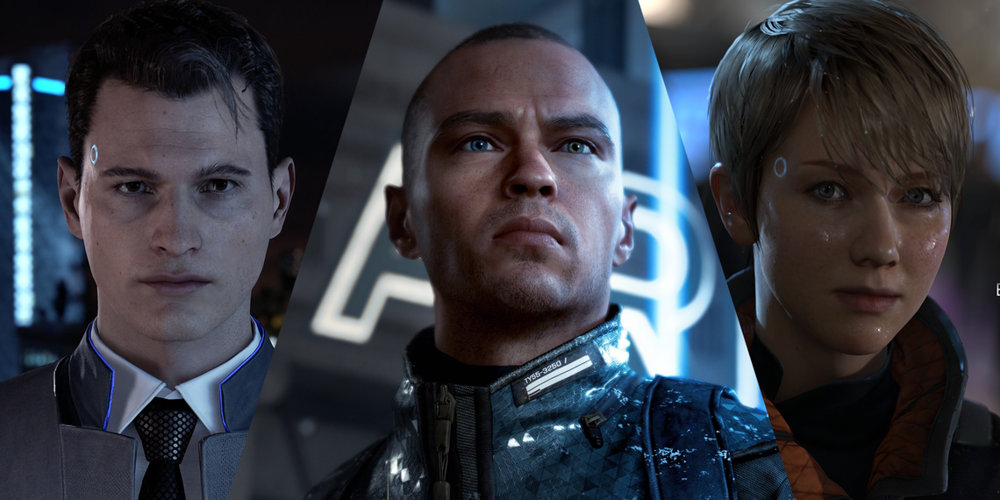

# choice

everything in life is a **choice**. choosing doesn't exist in mind or on paper, it only finds meaning in **actions**. every action we take or don't, is a choice. our resources are limited so we need to **prioritize** our options. choosing means **sacrificing**, that's the **newton's third law**, in order to get somewhere we have to leave sth behind. those who can't sacrifice anything will gain nothing. to choose sth means to sacrifice all the other **possibilities** and alternatives. if we see with **eys wide open**, there are always **infinite** of them. but we usually tend to forget it and entrap ourselves inside a **box**. action produces information. more **experience** is more data to train ourselves with.

each choice comes with **uncertainty**. we are never sure about consequences of any action. we can just estimate their **probabilities** based on previous data we have (we are no different than LLMs). if we take 100 balls out of a sack and all of them are blue, can we be sure that the ball 101 will be blue? no. but it's still the wisest thing to **bet** on. nobody knows what the hell they're doing, we are just continously moving on with our **current best guess** that has the highest **chance** of success. every choice is a **gamble** with its own percentage of **risk** (would you like 10$ with 50% success change or 50$ with 10%?).

our **resources** are our **wealth** (time/health/money/people/kowledge/feelings/impressions/skills/qualities/...) and every choice is an **exchange** and trade-off between them. we get wealthier by **arbitrage** (ryan trahan). some of the resources are limited and irreplaceable, they need to be spend wisely. some are infinte or can be used forever (though overusing them can cause their value to drop). some can be leveraged.

the **right choice** is always the hardest one, even when it's not. when we choose the hardest, we **prove to ourselves** that we are able to choose anything else too. **overcorrection** frees us from our doubts. the man that has been far-left and far-right, can stand anywhere he wants.

we can only see the consequences of the paths we have taken. most of the others remain **uknown** to us. life can only be understood backwards, but it must be lived forwards.

the world has it's own agenda and if we don't choose, the it sets its own defaults for us.

i **want** sth, does is mean that i'm able to choose it? what happens when i can't choose. does it mean there's sth else that i want more than this or does it mean that i don't want this enough? can i **change** myself and what i want? is there **free will** or everything is written on stone? are we able to predict the future with certainty if we'd be able to simulate and calculate all the atoms inside a person and his outside world?