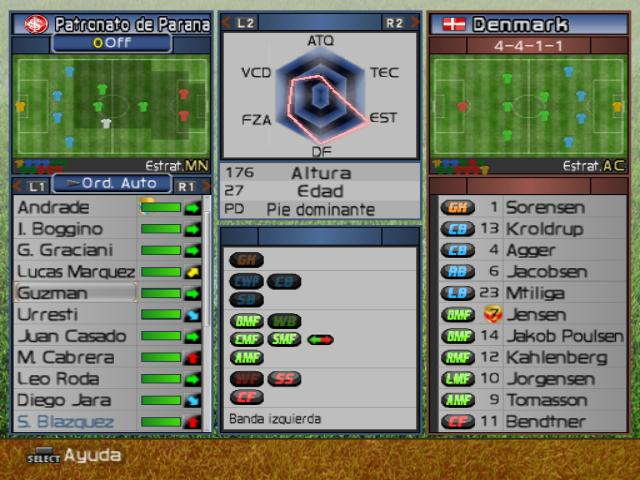

# true definition of perfection

i see lots of people that complain about perfectionism these days. i hear a lot that it's a toxic mindset and how being a perfectionist is making us miserable. my friends say it's preventing them from enjoying their lives.

**but i would like to disagree**

i believe that people have misunderstood the true definition of perfection and that's why they find themselves miserable and blame perfectionism for it. but that's not perfection, it's something else. maybe obsession.

so let me share my own understanding of perfection.
i believe that our ultimate goal in life is to maximize. maximizing things that matter to us: happiness, love, experiences, money, ...

**my definition is to maximize all of the things that matter to us, without discrimination.**
we ususally forget that. we get obsessed with only one or few aspects of our lives. we spend lots of time to make money, but we forget to spend it on our hobbies. we spend lots of energy on making academic success, but we forget to spend any for our health. we spend lots of resources on getting affirmation from others, but forget to learn how to self-love. and so on...

the bold analogy i have in my mind is the hexagon stats from video games:

if you are a gamer, you've probably saw hexagons like this a lot. for example in a footbal game, each player stats is mapped to a hexagon with each vertic symbolizing as a different skill like stamina, shooting, dribbling, passing, ...

in these games when you want to compare players with each other, you look at the total area that skills of a player are making. sometimes a player can be very good at one skill, but a total disaster in another one. so the tricky thing is how to balance things out to maximize the area they cover. the thing is no player can't be 100% good at all skilles. he has a limited time and he has to choose which skills to practice on. same with our lives. we have limited points (time, energy, money, ...) in our total life time for assigning them to each vertic. so maximizing one of them is a fatal mistake that will result in failing of maximizing the whole pack of them.

so back to my definition of perfection. the problem in our lives is that we tend to forget this big picture. we get obsessed with one side of our life's hexagon and lose the other sides. we aim for perfection in limited box of one aspect (university, relationships, money, work, health, ...) and make ourselves miserable. then blame the notion of perfectionism, while true perfectionsim has been to think out of the box of a single aspect in the first place.

these boxes and hexagons happen to exist in every sub-aspect of our lives too. i see it as a fractal. for example programming has its hexagon of frontend, backend, algorithm, ... in linguistics we have grammar, listening, speaking, ... in relationships we have our partner, family, frineds, ... and so on.

**i beileve that the healthiest attitude is to apply the perfectionism eaqually to all aspects of our life as a whole. it would mean to satisfice in each aspect after a certain good-enough point and sacrifice rest of it to be able to go for the others.**