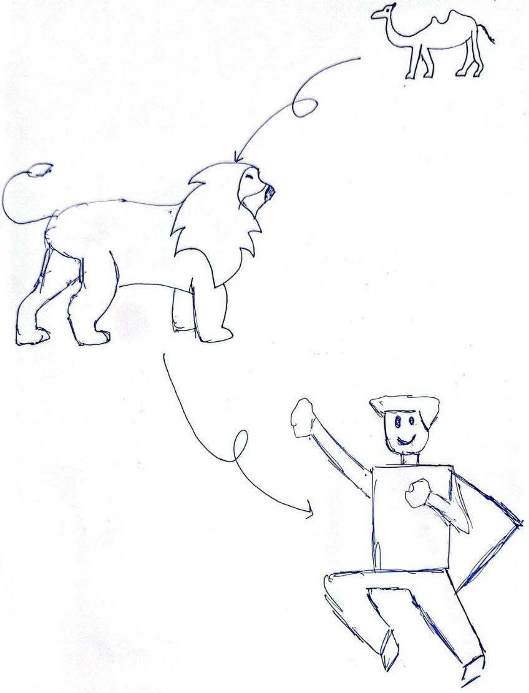

# week 1281

rot47 encryption
https://github.com/librespot-org/librespot/discussions/1562#discussioncomment-14652556

librespot - Open Source Spotify client library
https://github.com/librespot-org/librespot/

apple music downloader
https://aaplmusicdownloader.com/

w3schools c# tutorial
https://www.w3schools.com/cs/cs_getstarted.php

c# coding conventions
https://learn.microsoft.com/en-us/dotnet/csharp/fundamentals/coding-style/coding-conventions

codeforces MAD Interactive Problem - div 1
https://codeforces.com/contest/2159/problem/A

---

steve cutts - hapiness
https://youtu.be/e9dZQelULDk

---

- mvc: model view controller

---

when i was a teenager, my life was (relatively) harder. my family wasn't financially and emotionally as stable as now. that made me want to push forward and stay strong. that was my flame. i wanted to become better than my parents, i wanted to build a better life. and i tried.

in the recent years though, things changed. my life became easier and more stable; that somehow made me lazy, arrogant and complacent. i used to work like hell. i was passionate to learn, to build and to achieve great big things; and at some small levels, i actually did. i built some small projects, found some followers and earned respect of some people. after that i gradually felt like i'm a big deal. my attitude toward learning changed and i forgot how much more there is still to learn, to build, to try, to experience...  i reached a local optimum and it can be a very dangerous thing. it's like a swamp that chains your feet to the ground and keeps you from moving forward. it keeps you right where you are, because you choose to let it, because it's actually a joyful safe zone.

so let's break this cycle. it's important to do it now that i'm aware of it. it doesn't happen a lot, but sometimes when i see somebody in twitter or telegram or podcasts that is doing some real shit, i'm like damn, that was my dream years ago but i got lost in the process. i need to find myself again.