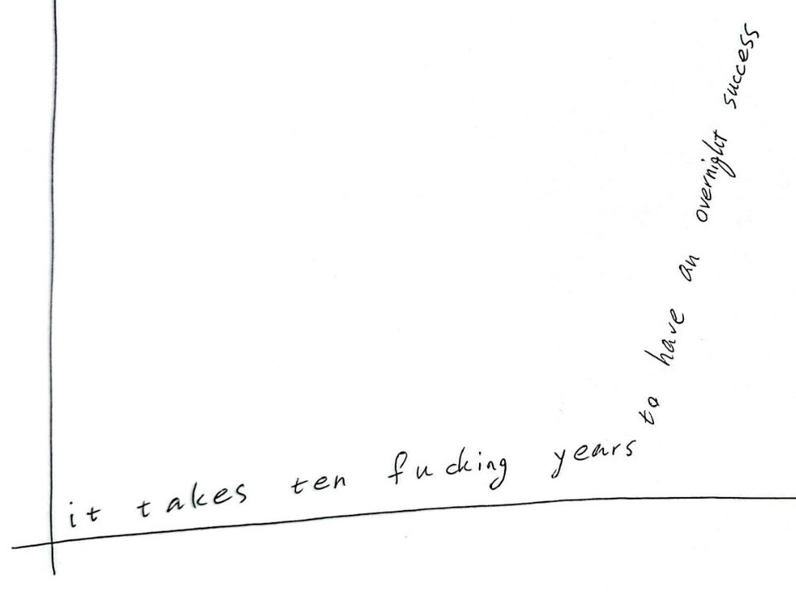

# week 1282

---

there are many times that i feel absolutely broken and devastated, but i came to 2 understandings:
1. my body/mind experiences sinusoidal feelings. one moment i can feel i can conquer the world and the next one i feel helpless. i learned some tips & tricks to alleviate it, like spending time with a friend, watching a movie, taking a shower, etc. but the most important thing is to just wait, not to panic, not to lose myself, not to torture myself and wait in peace till my groove comes back.
2. every problem is an opportunity. if looked from an optimistic point of view, every problem is a chance to create value by solving sth for people.