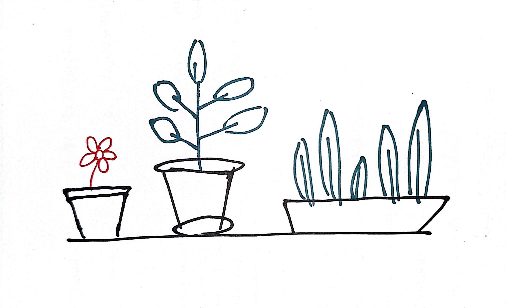

# week 1285

---

imperfection always exists.
what i can imagine and comprehend is always some steps further than what i can do or what i'm doing right now.
so i'm always gonna be behind that standard.
by understanding this maybe i can avoid the stress and anxiety and embrace imperfection.